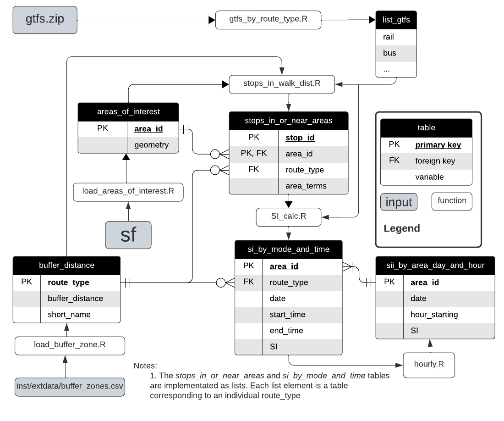

---
title: "Leveraging GTFS data to assess transit supply"
runningheader: "Reynolds (2024)" # only for pdf output
author: "James Reynolds"
date: "`r Sys.Date()`"
output:
  tufte::tufte_html:
    citation_package: natbib
    latex_engine: xelatex
bibliography: [packages.bib, References.bib]
link-citations: yes
header-includes:
  - \usepackage{titling}
  - \pretitle{\begin{center}
    \includegraphics[width=2in,height=2in]{ptrg-logo-s.png}\LARGE\\}
  - \posttitle{\end{center}}

---

<!--- Header to produce this as a PDF Book instead
output:
  tufte::tufte_book:
    citation_package: natbib
    latex_engine: xelatex
    includes:
      in_header: "preamble.tex"
bibliography: [packages.bib, References.bib]
link-citations: yes
header-includes:
  - \usepackage{titling}
  - \pretitle{\begin{center}
    \includegraphics[width=2in,height=2in]{ptrg-logo-s.png}\LARGE\\}
  - \posttitle{\end{center}}
--->


```{r setup, include=FALSE}
library(tufte)

library(tidyverse)
library(tidytransit)
library(sp)
library(strayr)
library(ptinpoly)
library(magrittr)
library(ggplot2)
library(sf)
library(ASGS.foyer)
library(raster)
library(ggmap)
library(units)
library(janitor)
library(mapview)
library(ggstatsplot)
library(gtsummary)
library(moments)
library(scales)
library(gtfstools)
library(lubridate)
library(kableExtra)
library(knitr)
library(readxl)
library(dplyr)
library(devtools)
load_all()
# invalidate cache when the tufte version changes
#knitr::opts_chunk$set(cache.extra = packageVersion('tufte'))
```

# Introduction
"If you can't measure it, you can't manage it" 
is often miss-attributed to @Deming1993new, 
who was actually trying to
make the opposite point [@Berenson2016]. 
Regardless, 
service level indicators 
are an important part of 
researching, 
managing 
and seeking to improve transit operations 
[@FieldingGordonJ1987Mpts; @Ryus:2003aa]. 
A wide range of indicators already exist. 
Examples include: 
those in the Transit Capacity and Quality of Service Manual (TCQSM)[@TCQSM:2013], 
the Transit Score metric [@WalkScore:2023tg] 
and many more.

Practitioners, 
researchers 
and advocates 
seeking to use such metrics 
may face two inter-related challenges: 
(1) 
there is the problem of calculating the metrics themselves 
for a specific location 
and service pattern; and
(2) 
is the challenge of explaining the metrics, 
their meaning 
and importance 
to those who are not specialists in transit, 
such as to politicians 
or the general public^[
Of the examples above, 
the metrics in the TCQSM appear: 
difficult to calculate in practice, 
and difficult to explain 
because there are a multitude of indicators 
(although there is an entire guidebook explaining them, which might help somewhat); 
while,
in contrast, 
Transit Scores can be obtained 
simply by typing an address into a website, 
but cannot be calculated independently 
and lack a detailed 
(and open source) 
description of the methodolgy / algorithm.].
However, 
a relatively simple transit Supply Index (SI) 
has been previous developed [@currie2007identifying], 
This reduces service levels to a single score 
(like the Transit Score), 
but is open 
and can be independently calculated by anyone.
It is obtained by calculating 
the number of transit arrivals 
at stops within an area of interest, 
with an adjustment made to account for the typical walk-access catchment for each stop. 
Hence, 
higher SI scores indicate 
areas with higher frequency 
and/or better coverage. 

Unfortunately, 
the SI does not appear to have been widely used, 
perhaps in part because at the time it was first published 
timetable data was not typically publicly available 
in a standardized 
and machine-readable format. 
The scores reported in Currie and Senbergs (2007)
has been calculated directly from a database of services 
provided by the transit authority 
in Melbourne, Australia. 
However, this database appears to have been 
in a format specific to Victoria 
and the agency itself^[
Public Transport Victoria (PTV)],
and so if SI scores for a different location were desired^[Or perhaps even for Melbourne again, 
but at a different time 
given that the database format has likely changed 
and the Currie and Senbergs (2007) analysis algorithms are not readily available.] 
considerable work would be required to wrangle the data and calculate scores.  

However, 
since the widespread adoption 
of the General Transit Feed Specification (GTFS), 
timetable data 
and tools for processing it 
are now much more widely available 
than they were in 2007.
More than 10,000 agencies 
are now providing GTFS feeds^[There are two forms: 
GTFS-static consisting of the timetable data (the scheduled services); 
and GTFS-realtime, which includes vehicle arrivals and departure times based on real-world position data. 
This paper and project uses only the GTFS-static (timetable) format.][@GTFS],
suggesting that the development of code 
to calculate SI scores directly from GTFS 
might allow it to be used more widely 
in research and practice.  
Previous work undertaken 
by Monash University's Public Transport Research Group (PRTG), 
available on Github [@SI_github], 
developed R functions to calculate SI scores 
from the Victorian PTV GTFS feed. 
However, 
the code was inefficient^[
To calculate SI scores for the Victorian GTFS feed 
would take the original code base approximately as long as it the service delivery itself took 
i.e. (SI scores fora whole week of transit service would take a whole week to compute!).] 
and untidy, 
and only allowed scores to be calculated for a whole day of transit service. 

More recently, 
PTRG has commenced a project which requires SI scores by hour of the day. 
Unfortunately, 
the current code does not have this capability, 
and major changes will be needed to calculate stop arrivals on an hourly, rather than daily, basis. 
However, 
this also provides an opportunity to revise and improve the code 
so that it is more readily accessible, 
usable and 
understandable for others, 
and quicker. 

This document reports 
the development of code to calculate SI scores 
from GTFS datasets 
as an R package [@gtfssupplyindex_github]. 
Structuring the code as an R package^[
Rather than as scripts within a R Markdown file, 
as for the original Transit_Supply_Index_GTFS efforts] 
provides various advantages as far as 
adhering to standardised conventions, 
accessibility and sharing, 
testing 
and so on [@wickham2023r]. 
More broadly, 
the motivation for this research is 
to better understand how GTFS data might be used 
to produce benchmarking metrics that can be calculated using open-source code. 
Such metrics might then be able to be used 
to assess proposed network changes 
or other analyses 
without the need for specialist software 
or bespoke calculation^[
More formally, 
the (null) hypothesis tested in this research is 
that the Supply Index cannot be calculated directly from a GTFS feed.]. 
A related objective is 
to increase the availability of metrics that are relatively easy to understand and use 
when making decisions about 
or advocating for changes to existing services, 
including for those who may not 
be technical specialists 
in transit planning and scheduling. 

The rest of this document 
is structured as follows: 
the next section discusses the research context 
of transit metrics 
and the the Supply Index. 
In the third section 
the methodology adopted for the code development is outlined, 
including discussion of the case studies 
(GTFS feeds) 
used to test and verify the code output. 
In the fourth section 
results are presented, 
including SI scores for SA1s across Greater Melbourne on an hour-by-hour basis. 
Results are then discussed, 
followed by a brief conclusion 
that includes the identification of directions for future research.  


# Research context

Even a brief search shows 
that there is a very large number of metrics 
available for benchmarking transit services. 
Examples include: 
(1) those in the Transit Cooperative Research Program (TCRP) Report 88, which is an extensive guidebook on developing a performance-measurement system [@Ryus:2003aa]; 
(2) online databases provided by 
the Florida Transit Information System (FTIS) [@Florida-Transit-Information-System:2018aa] 
and @UITP:2015aa; 
(3) those used in the extensive annual benchmarking programme 
undertaken yearly by the Transport Strategy Centre, 
which includes over 100 transit providers around the world [@Imperial-College-London:2023aa]; and
(4) a recently developed methodology to calculate 'blank spots' within an area, 
being those places beyond 400/800 metre walking distances to/from bus and tram stops/train stations [@AlamriSultan2023GAoA]. 
  
  
The Fielding Triangle [@FieldingGordonJ1987Mpts] provides a framework 
for understanding how such metrics combine 
service inputs, 
service outputs 
and service consumption 
to describe cost efficiency, 
cost effectiveness 
or service effectiveness. 
At a larger scale, 
@Litman:2003ab 
and @Litman:2016aa 
discuss some of the traffic, 
mobility, 
accessibility, 
social equity, 
strategic planning 
and other rational decision-making frames 
that might underlie such transit metrics, 
while @Reynolds:2017ah extends this into models of how 
institutionalism, 
incrementalism 
and other public policy models 
might apply to decision-making processes. 
Further examples include:
(1) @GuzmanLuisA.2017Aeit, 
who develop a measure of accessibility 
in the context of policy development 
and social equity 
for Latin American Bus Rapid Transit (BRT) based networks; and 
(2) the street space allocation metrics 
based around 10 ethical principles 
introduced by @Creutzig2020streetspaceallocation. 

However, 
many of these metrics appear difficult to calculate, 
complex to explain or understand, 
and likely not well suited to communication 
with those who are not transit planners or engineers, or otherwise technical specialists. 
Where pre-calculated metrics 
are immediately available 
it may not be possible for  practitioners, 
researchers 
or advocates 
to independently generate metrics for proposed system changes 
or to even know exactly how scores for the existing services levels are calculated. 
For example, 
Transit Scores 
for locations with a published GTFS feed 
are readily available on a website, 
eliminating the need for any calculations. 
The meaning of these Transit Scores 
appears easy to explain, 
as the highest possible score of 100 
represents what might be experienced in the centre of New York[@WalkScore:2023tg]]. 
However, 
the Transit Score algorithm 
is patented 
and effectively a black box. 
It is not possible to calculate scores independently 
or understand how the metric might change 
with alteration to the transit system or services, 
or the surrounding environment. 
Transit Score, therefore, 
fails the first of the aforementioned challenges, 
as practitioners, researchers and advocates 
can only use those scores provided by @WalkScore:2023tg
While the metric is simple to explain, 
as the closer to 100, the better, 
because it is based on 
a patented algorithm it may not be easy to understand or explain 
the connection between real-world conditions 
and the Transit Score, 
or what might need to be done 
to improve the score and service levels. 
Nor does it appear to be possible 
for Transit Scores to be generated for proposed changes to networks. 

Another example is the TCQSM, 
which specifies Levels of Service (LOS) between A and F 
across a range of factors^[
Including service span, 
frequency, 
speed, 
the proportion of the population serviced, 
competitiveness of travel times to car-based travel, 
and many more.]. 
This scoring scheme appears relatively simple to explain^[
A is good and F is bad. 
Also this scoring system matches the A to F LOS scoring used in many traffic capacity analysis software and manuals.], 
and the detail within @TCQSM:2013 
provides a resource for anyone wanting to better understand what the scores mean. 
However, 
calculation of many of TCQSM metrics may need specialised software 
and datasets^[
For example, 
the Service Coverage Area metric in the TCQSM (pp. 5-8 to 5-21) 
may require GIS or other analysis, 
on top of accurate data about population densities, 
stop locations 
and service schedules.] 
and it might be challenging to explain 
the detail of these measures 
or how to improve them 
to non-technical decision-makers, 
stakeholders 
or others involved in transit management or advocacy. 

The introduction of the General Transit Feed Specification (GTFS) 
and widespread release of schedule data in this format, 
however, 
has helped towards making transit metrics more broadly available and useable. 
GTFS is an open, 
text-based format 
that was developed originally to allow transit information to be included in the Google Maps navigation platform [@GTFS]. 
The data structure is shown in the below figure. 

```{r GTFS_ERD, fig.width = 10, fig.height = 2, fig.fullwidth = TRUE, fig.cap = "GTFS entity relationship diagram. Source: adapted by author from Alamri et al (2023) and the GTFS Schedule Reference (16/11/2023 revision).", echo = FALSE, warning=FALSE, message=FALSE, cache=TRUE, out.width='100%'}
knitr::include_graphics("graphics/GTFS.png")

```

In the Entity Relationship Diargram (ERD) shown above, each box represents a database table in the GTFS, with table rows indicating the variables (columns) included in each^[For example, each record in the 'stops' table includes a value for stop_id, stop_name, stop_lat and stop_lon.]. Relationships between the tables are indicated by the connecting lines, and Primary Key (PK) and Foreign Key (FK) designations^[For example, stop_id also appears in the 'stop_times' table as a Primary Key and Foreign Key.]. `Crow's feet' indicate the relationships between each table^[See https://i.stack.imgur.com/fxaAq.png for guide to the symbols. But, for example, the stops table is required, with the stop_id field providing a unique (primary) key for every stop. Within the stop_times table (which is also required) the stop_id field is a foreign key. Each unique stop_id can appear many times in the stop_times table, but must appear only once in the stops table. In the stop_times table each combination of trip_id, stop_id and arrival time must be unique (But, see note 2!) meaning that these fields represent a composite key.].

GTFS now provides a mechanism 
for including individual transit systems 
in many online products and analyseses, 
including the Transit Score metric itself. 
@Wong:2013aa provides another example of what can be done with GTFS data, 
having developed code to calculate of some of the TCQSM metrics^[
Daily average headways, 
route length 
and stop numbers 
for 50 transit operators.]. 
While the @Wong:2013aa open-source code is readily available^[
https://github.com/jcwong86/GTFS_Explore_Tool] 
this is now 11 years old 
and does not appear to be currently maintained. 
Future research may involve 
reviewing this code 
and using it to analyse modern GTFS feeds. 
However, 
in this paper the aim is more modest, 
being to use GTFS data to calculate Currie and Senbergs' (2007) SI.   


## The Suppy Index

```{marginfigure}
\begin{equation}
  SI_{area, time} = \sum{\frac{Area_{Bn}}{Area_{area}}*SL_{n, time}}
  \end{equation}
```

The Supply Index (SI) equation 
is shown in the margin figure^[
Minor adjustments have been made 
to generalise the equation, 
as Currie and Senbergs (2007) focus 
was the context of Melbourne's Census Collection Districts (CCD) 
and calculations based on a week of transit service. 
CCDs predate the introduction of 
Statistical Areas 1, 2, 3, and 4 (SA1, SA2, SA3, SA4), 
and other geographical divisions 
currently used by the Australian Bureau of Statistics (ABS), 
which may be more familiar to readers.], 
in which:
(1) $SI_{area, time}$ is the Supply Index for the area of interest 
and a given period of time;
(2) $Area_{Bn}$ is the buffer area for each stop (n) within the area of interest. 
In Currie and Senbergs (2007) this was based on 
a radius of 400 metres for bus and tram stops, 
and 800 metres for railway stations;
(3) $Area_{area}$ is the area of the area of interest; and
(4) $SL_{n,time}$ is the number of transit arrivals for each stop 
for a given time period.

An advantage of the SI is 
that it is a relatively simple number 
to calculate, 
understand 
and explain. 
It describes 
the number of transit arrivals 
at stops within 
an area of interest 
and time frame, 
multiplied by a factor 
accounting for the proportion of the area of interest that is within typical walking distance of each stop. 
Hence, 
more services, 
more stops 
and higher frequencies 
would all increase the SI score. 
The SI does not incorporate 
service span, 
speed 
or other elements of a transit service. 
These may be important 
to passenger experience, 
but might add considerable complexity. 
Simplicity is also helped 
by the way 
that the Index is additive, 
in that $SI_{area, time}$ scores can be aggregated 
to calculate an overall score 
across multiple time periods 
or for a region encompassing multiple areas of interest. 


# Methodology
R [@R-base], a widely used and readily available  statistical programming language, was adopted for code development. The package development setup and workflow described by @wickham2023r 
was adopted in this study. 

Various existing packages were relied upon including: the sf package [@R-sf] for geospatial analysis; the tidyverse [@tidyverse2019]; gtfstools [@R-gtfstools]; and tidytransit [@R-tidytransit]. Some code was adapted from the tidytransit, gtfstools and other package's examples, vignettes and other documentation.
Tidytransit is licensed under GPL-2 | GPL-3, 
while gtfstools is lincensed under the more permissive MIT license. 
For simplicity, 
the gtfssupplyindex package developed here 
is licensed under GPL-3 
so as to match tidytransit. 

## Cases

```{r mornington_map, fig.margin = TRUE, fig.cap = "Mornington Penninsula SA1 zones and location of Mornington Tourist Rail stops.", echo = FALSE, warning=FALSE, message=FALSE, cache=TRUE}
### ---------------- get abs data for Mornington Peninsula
#options(timeout = 1000)
#remotes::install_github("wfmackey/absmapsdata")

#get_mornington_sa1 <- function(){
#  mornington_sa12021 <- absmapsdata::sa12021 %>% filter(sa3_name_2021 == "Mornington Peninsula") %>% select(sa1_code_2021)
#  sf::st_write(mornington_sa12021, "inst/extdata/mornington_sa12021.geojson", append=FALSE)
#  return(mornington_sa12021)
#}
#get_mornington_sa3 <- function(){
#  mornington_sa32021 <- absmapsdata::sa32021 %>% filter(sa3_name_2021 == "Mornington Peninsula") %>% select(sa3_code_2021)
#  sf::st_write(mornington_sa32021, "inst/extdata/mornington_sa32021.geojson", append=FALSE)
#  return(mornington_sa32021)
#}

### ---------------- load SA3 abs maps data for just mornington peninsula
areas_of_interest <- load_areas_of_interest(areas_of_interest = absmapsdata::sa12021 %>% filter(sa3_name_2021 == "Mornington Peninsula") %>% select(sa1_code_2021), 
  area_id_field = "sa1_code_2021")

# map the areas_of_interest
map <- areas_of_interest %>% 
  ggplot() +
  geom_sf(aes(geometry = geometry))
#map
#set the EPSG to transform from lat/lon to metres
EPSG_for_transform = 28355

### ---------------------------- load and update the route_types in the mornington gtfs data
mornington_2019 <- tidytransit::read_gtfs("inst/extdata/mornington180109/gtfs.zip")
#deal with issue to do with missing route_color information
mornington_2019$routes$route_color <- "Blue"
#convert route type from 107 (tourist railway) to 2 (rail) ---NEW FEATURE NEEDED --- EXPAND HANDLING OF MODES TO ENABLE CALCULATION OF MODES FROM EXTENDED GTFS LIST
mornington_2019$routes$route_type <- as.integer(2)
# write back to zip file
tidytransit::write_gtfs(mornington_2019, "inst/extdata/mornington180109/gtfs.zip")

#load the revised mornington GTFS data
list_gtfs = gtfssupplyindex:::gtfs_by_route_type("inst/extdata/mornington180109/gtfs.zip")

stops_as_sf_mornington <-  list_gtfs[[1]]$stops %>% 
  tidytransit::stops_as_sf()

#map the stops on the ABS data
map + 
  geom_sf(data = stops_as_sf_mornington, aes(geometry = geometry))

stops_in_or_near_areas <- gtfssupplyindex:::stops_in_walk_dist(
  list_gtfs = list_gtfs, 
  areas_of_interest = areas_of_interest,
  buffer_distance = gtfssupplyindex:::load_buffer_zones(),
  EPSG_for_transform = 28355
)

```

Code development was undertaken using a number of cases for testing purposes, being: the  Mornington Penninsula Tourist Railway, the New York subway, and Melbourne. 


The Morning Penninsula Tourist Railway runs on Sundays and Wednesdays between Moorooduc and Mornington, with an intermediate stop at Tanti Park^[https://transitfeeds.com/p/mornington-railway/806/latest/stops]. A GTFS feed from 2018 was selected. ABS data was also used, 
primarily through the strayr 
and absmapsdata packages [@r-strayr].
The Mornington Peninsular SA3 zone and the SA1 zones contained within were adopted as the areas_of_interest. 

Tidytransit includes a sample GTFS feed from New York's MTA
(including the subway!), 
and so this was used for code tests were appropriate. 
<MORE DETAILS ABOUT THIS>

Larger scale testing was performed using the Victorian GTFS feed, 
published by Public Transport Victoria (PTV), 
sourced via @transitfeeds_victoria:2023aa for historical feeds. 
Again, ABS data was used for the areas_of_interest. 


# Results
## Code structure 
Developed code is available and documented on github [@gtfssupplyindex_github]. 
The structure is shown in the below Entity Relationship Diagram (ERD). 


```{r SI_ERD, fig.width = 10, fig.height = 2, fig.fullwidth = TRUE, fig.cap = "SI data structure entity relationship diagram.", echo = FALSE, warning=FALSE, message=FALSE, cache=TRUE, out.width='100%'}


```

The code takes input from three files: 

- a gtfs feed (gtfs.zip)
- a sf object describing the geometry of the areas for which the SI is to be calculated
- a csv file defining the buffer zone distances (in metres) for each route_type.

It outputs the si_by_area_day_and_hour table (bottom right), which reports the SI score for each hour of the day across dates specified by the user. The calculation of the SI scores is described in the following, which shows examples based on the Mornington Peninsula Tourist Railway GTFS and ABS datasets. 

GTFS data is first loaded, with the gtfs_by_route_type function splitting this into a list of tidygtfs objects, with one list element for each route_type present in the gtfs data.  

```{r load_mornington_GTFS data, echo = TRUE, warning=FALSE, message=FALSE, cache=TRUE, out.width='100%'}
#load the revised mornington GTFS data
list_gtfs = gtfssupplyindex:::gtfs_by_route_type(system.file(
  "extdata/mornington180109",
  "gtfs.zip", 
  package = "gtfssupplyindex", 
  mustWork = TRUE))

names(list_gtfs) %>% kable(caption = "tidygtfs objects within list_gtfs")
names(list_gtfs[[1]]) %>% kable(caption = "tidygtfs structure of first elemnent of list_gtfs")
```

Geographical data about the areas of interest are first loaded by the load_areas_of_interest.R function into an sf object, containing that area_id key and associated geometry.   

```{r load_ABS data, echo = TRUE, warning=FALSE, message=FALSE, cache=TRUE, out.width='100%'}
areas_of_interest <- load_areas_of_interest(areas_of_interest = sf::st_read(system.file(
  "extdata",
  "mornington_sa12021.geojson", 
  package = "gtfssupplyindex", 
  mustWork = TRUE)), 
  area_id_field = "sa1_code_2021")
head(areas_of_interest) %>% kable(caption = "First 6 entries in areas_of_interest table")

```

The data about buffer zones, specifically the walking distance threshold assigned to each route_type (mode) is then loaded, again through a function (load_buffer_zone.R). 

```{r load_buffer_distance_data, echo = TRUE, warning=FALSE, message=FALSE, cache=TRUE, out.width='100%'}
buffer_distance <- gtfssupplyindex:::load_buffer_zones()
head(buffer_distance) %>% kable(caption = "First six entries in buffer_distance definitions")
```
The stops_in_walk_dist function then generates a list, again with each element representing a route_type (mode), of stops_in_or_near_areas tables. Each entry in the tables consists of a stop_id and area_id that are within the buffer_distance threshold of each other, and the corresponding area related terms in the SI calculation ($Area_{Bn} / Area_{Area}$. 


```{r calculate_stop_in_or_near_areas, echo = TRUE, warning=FALSE, message=FALSE, cache=TRUE, out.width='100%'}
stops_in_or_near_areas <- gtfssupplyindex:::stops_in_walk_dist(
  list_gtfs = list_gtfs, 
  areas_of_interest = areas_of_interest,
  buffer_distance = buffer_distance,
  EPSG_for_transform = 28355
)

head(stops_in_or_near_areas[[1]]) %>% kable(caption = "'Rail' element of the stops_in_or_near_areas list for the Mornington Pennisula datasets, first six entries")
```
The variables passed to the stop_in_or_near_areas function are list_gtfs (the list of tidygtfs objects), areas_of_interest (the output of the load_areas_of_interest functions), the buffer_distance table, and an EPSG_for_transform variable. This last variable is the Coordinate Reference System (CRS) value relevant to the geographic location. It is used to project the latitude and longitude values included in the GTFS data and area_of_interest data into metres, in this case relating to the GDA94 / MGA zone 55 relevant to Australia^[https://epsg.io/28355].  

The stops_in_or_near_areas function itself does a lot of work, so is discussed in more detail in the following section.  

### stops_in_walk_dist function

The first part of the stops_in_walk_dist function simply filters out all of the unneeded buffer_distance entries. 

```{r fulter_buffer_distance, echo = TRUE, warning=FALSE, message=FALSE, cache=TRUE, out.width='100%'}
  # Keep only buffer distance definitions for those routes_types in the gtfs
  buffer_distance <- buffer_distance[ 
    which(
      buffer_distance$short_name %in% 
        names(list_gtfs))
    ,]
buffer_distance %>% kable(caption = "Filtered buffer_distance table")

```

Next the areas_of interest are transformed from latitude and longitude into metres, and the area is calculated. 

```{r transform_areas, echo = TRUE, warning=FALSE, message=FALSE, cache=TRUE, out.width='100%'}


  # transform areas_of_interest to CRS in metres
  areas_of_interest <- sf::st_transform(areas_of_interest, EPSG_for_transform)
 
  # calculate Area_area terms
  areas_of_interest$area_area <- sf::st_area(areas_of_interest)
  
  head(areas_of_interest) %>% kable(caption = "Areas of first six SA1 zones in Mornington Penninsula SA3")

```
  The stops_in_walking_distance function then applies a sub-function, stops_in_walk_dist_one_route, to the list_gtfs (list of tidygtfs objects). First, a list of stops is extracted from the tidygtfs, using the stops_as_sf function from @R-tidytransit. 
  
```{r stops_as_sf, echo = TRUE, warning=FALSE, message=FALSE, cache=TRUE, out.width='100%'}

  #variables passed by lapply
    gtfs_single_route_type = list_gtfs[[1]]
    buffer_distance_length = 800

  #get stops as sf from the gtfs, listed by route_type, using stops_as_sf_function (see below)
  stops_as_sf <- tidytransit::stops_as_sf(gtfs_single_route_type$stops)
  #drop everything except geometry and stop_id
  stops_as_sf <- stops_as_sf %>% dplyr::select(stop_id, geometry)
  
  # map the stops onto the areas_of_interest for the first element in the list
  #map + 
  #  geom_sf(data=list_of_stops_as_sf[[1]], size = 2)

  head(stops_as_sf) %>% kable(caption = "Stops extracted from Mornington GTFS")
```
Circles are then drawn around each stop, with the radius equal to the buffer distance.  Intersecting these circles with the areas_of_interest then outputs an sf showing the catchment of each stop within each area of interest


```{r buffer_circles, echo = TRUE, warning=FALSE, message=FALSE, cache=TRUE, out.width='100%', fig.margin = TRUE, fig.cap="Catchment of each stop within each area of interest"}
  # transform stops to CRS in metres
  stops_as_sf <- stops_as_sf %>% sf::st_transform(crs = EPSG_for_transform)
  
  #draw radius around stops of the buffer zone
  circles_around_stops <- stops_as_sf %>% sf::st_buffer(dist = buffer_distance_length)
 
  # Intersect the circles
  stops_in_or_near_areas <- sf::st_intersection(areas_of_interest, circles_around_stops)
  
  ggplot() + 
    geom_sf(data=stops_in_or_near_areas, aes(fill = area_id)) + 
    theme(legend.position = "none")
  
```
Finally, the $area_{Bn}$ terms are calculated for each combination of stop_id and area_id, 


```{r area_calculations_Bn_and_area_terms, echo = TRUE, warning=FALSE, message=FALSE, cache=TRUE}
   
  # calculate the area_BN_term and drop geometry
  stops_in_or_near_areas$area_Bn <- sf::st_area(stops_in_or_near_areas)
  stops_in_or_near_areas <- stops_in_or_near_areas %>% sf::st_drop_geometry()

  # join areas_of_interest areas (but not the area geometry)
  stops_in_or_near_areas <- dplyr::left_join(stops_in_or_near_areas, areas_of_interest %>% sf::st_drop_geometry())
  
  # calculate combined area terms 
  stops_in_or_near_areas$area_terms <- stops_in_or_near_areas$area_Bn / stops_in_or_near_areas$area_area
  # drop units 
  stops_in_or_near_areas$area_terms <- as.numeric(stops_in_or_near_areas$area_terms)
  
  head(stops_in_or_near_areas %>% dplyr::select(stop_id, area_id, area_terms)) %>%
    kable(caption = "Output of stops_in_walk_dist_one_route for Mornington Peninsula, first six entries")
  
```


### Calculating stop arrivals and the SI


### Hourly

As discussed above, the SI is additive, so the si_by_area_day_and_hour table can be calculated from a si_by_mode_and_time table containing individual SI scores by mode^[SI calculations must be on a per mode basis up until the final aggregation because individual modes may have different buffer distances.] for individual periods of time. 

The buffer_distance table draws data from Comma Separated Variables (CSV) file, based on the Extended GTFS Route Types definitions^[https://developers.google.com/transit/gtfs/reference/extended-route-types], with defaults of 800 metres and 400 metres for heavy rail and all other modes respectively. 

The areas_of_interest table stores geometric information about the areas for which SI scores are desired, as simple features^[See https://cran.r-project.org/web/packages/sf/vignettes/sf1.html]. The stops_in_or_near_areas and si_by_mode_and_time tables are used to store components of the SI during the calculations, which are described in the following.  


CODE references
[@tidytransit_departure_timetable; @filter_GTFS_by_mode]


## Testing

### Mornington Pensinsula Tourist Railway and SA2 zones

Testing the code with the code with the same Mornington Peninsula Tourist Railway GTFS, but SA2 zones instead of SA1 provides the following results:

```{r mornington_SA2_test data, echo = FALSE, warning=FALSE, message=FALSE, cache=TRUE, out.width='100%', fig.margin = TRUE, fig.cap = "Catchment of each stop within each area of interest, Mornington Penninsula Railway and SA2 zones"}
#load the revised mornington GTFS data
list_gtfs = gtfssupplyindex:::gtfs_by_route_type(system.file(
  "extdata/mornington180109",
  "gtfs.zip", 
  package = "gtfssupplyindex", 
  mustWork = TRUE))

areas_of_interest <- load_areas_of_interest(absmapsdata::sa22021 %>% filter(sa3_name_2021 == "Mornington Peninsula") %>% select(sa2_code_2021),  area_id_field = "sa2_code_2021")

buffer_distance <- gtfssupplyindex:::load_buffer_zones()

stops_in_or_near_areas <- gtfssupplyindex:::stops_in_walk_dist(
  list_gtfs = list_gtfs, 
  areas_of_interest = areas_of_interest,
  buffer_distance = buffer_distance,
  EPSG_for_transform = 28355
)

  buffer_distance <- buffer_distance[ 
    which(
      buffer_distance$short_name %in% 
        names(list_gtfs))
    ,]
buffer_distance %>% kable(caption = "Filtered buffer_distance table")

# transform areas_of_interest to CRS in metres
  areas_of_interest <- sf::st_transform(areas_of_interest, EPSG_for_transform)
 
  # calculate Area_area terms
  areas_of_interest$area_area <- sf::st_area(areas_of_interest)
  
  head(areas_of_interest) %>% kable(caption = "Areas of first six SA2 zones in Mornington Penninsula SA3")

  #variables passed by lapply
    gtfs_single_route_type = list_gtfs[[1]]
    buffer_distance_length = 800

  #get stops as sf from the gtfs, listed by route_type, using stops_as_sf_function (see below)
  stops_as_sf <- tidytransit::stops_as_sf(gtfs_single_route_type$stops)
  #drop everything except geometry and stop_id
  stops_as_sf <- stops_as_sf %>% dplyr::select(stop_id, geometry)
  
  # transform stops to CRS in metres
  stops_as_sf <- stops_as_sf %>% sf::st_transform(crs = EPSG_for_transform)
  
  #draw radius around stops of the buffer zone
  circles_around_stops <- stops_as_sf %>% sf::st_buffer(dist = buffer_distance_length)
 
  # Intersect the circles
  stops_in_or_near_areas <- sf::st_intersection(areas_of_interest, circles_around_stops)
  
  ggplot() + 
    geom_sf(data=stops_in_or_near_areas, aes(fill = area_id)) + 
    theme(legend.position = "none")
  
  # calculate the area_BN_term and drop geometry
  stops_in_or_near_areas$area_Bn <- sf::st_area(stops_in_or_near_areas)
  stops_in_or_near_areas <- stops_in_or_near_areas %>% sf::st_drop_geometry()

  # join areas_of_interest areas (but not the area geometry)
  stops_in_or_near_areas <- dplyr::left_join(stops_in_or_near_areas, areas_of_interest %>% sf::st_drop_geometry())
  
  # calculate combined area terms 
  stops_in_or_near_areas$area_terms <- stops_in_or_near_areas$area_Bn / stops_in_or_near_areas$area_area
  # drop units 
  stops_in_or_near_areas$area_terms <- as.numeric(stops_in_or_near_areas$area_terms)
  
  stops_in_or_near_areas %>% dplyr::select(stop_id, area_id, area_terms) %>%
    kable(caption = "Output of stops_in_walk_dist_one_route for Mornington Peninsula Railway and SA2 zones, calculated piecemeal")
  
  ### compare to calculation using function only
stops_in_or_near_areas <- gtfssupplyindex:::stops_in_walk_dist(
  list_gtfs = list_gtfs, 
  areas_of_interest = areas_of_interest,
  buffer_distance = buffer_distance,
  EPSG_for_transform = 28355
)
  
  stops_in_or_near_areas[[1]] %>% dplyr::select(stop_id, area_id, area_terms) %>%
    kable(caption = "Output of stops_in_walk_dist_one_route for Mornington Peninsula Railway and SA2 zones, calculated using the stops_in_walk_dist function directly")
  
  
```

This appears to meet expectations, with fewer SA2 zones within the walking distance catchment of the stops.  As well, the area terms indicate that only a small fraction of each of the SA2 zones are within the catchment areas of the stops.  


### Mornington Pensinsula Tourist Railway and SA3 zones

Testing the code with the code with the same Mornington Peninsula Tourist Railway GTFS, but instead combining the areas_of_interest so that we are only looking at the Mornington Peninsular SA3 zone (in its entirety) gives:

```{r mornington_SA3_test data, echo = FALSE, warning=FALSE, message=FALSE, cache=TRUE, out.width='100%', fig.margin = TRUE, fig.cap = "Catchment of each stop within each area of interest, Mornington Penninsula Railway and SA3 zones"}
#load the revised mornington GTFS data
list_gtfs = gtfssupplyindex:::gtfs_by_route_type(system.file(
  "extdata/mornington180109",
  "gtfs.zip", 
  package = "gtfssupplyindex", 
  mustWork = TRUE))

areas_of_interest <- load_areas_of_interest(absmapsdata::sa32021 %>% filter(sa3_name_2021 == "Mornington Peninsula") %>% select(sa3_code_2021),  area_id_field = "sa3_code_2021")

buffer_distance <- gtfssupplyindex:::load_buffer_zones()

stops_in_or_near_areas <- gtfssupplyindex:::stops_in_walk_dist(
  list_gtfs = list_gtfs, 
  areas_of_interest = areas_of_interest,
  buffer_distance = buffer_distance,
  EPSG_for_transform = 28355
)

  buffer_distance <- buffer_distance[ 
    which(
      buffer_distance$short_name %in% 
        names(list_gtfs))
    ,]
buffer_distance %>% kable(caption = "Filtered buffer_distance table")

# transform areas_of_interest to CRS in metres
  areas_of_interest <- sf::st_transform(areas_of_interest, EPSG_for_transform)
 
  # calculate Area_area terms
  areas_of_interest$area_area <- sf::st_area(areas_of_interest)
  
  head(areas_of_interest) %>% kable(caption = "Areas of first six SA2 zones in Mornington Penninsula SA3")

  #variables passed by lapply
    gtfs_single_route_type = list_gtfs[[1]]
    buffer_distance_length = 800

  #get stops as sf from the gtfs, listed by route_type, using stops_as_sf_function (see below)
  stops_as_sf <- tidytransit::stops_as_sf(gtfs_single_route_type$stops)
  #drop everything except geometry and stop_id
  stops_as_sf <- stops_as_sf %>% dplyr::select(stop_id, geometry)
  
  # transform stops to CRS in metres
  stops_as_sf <- stops_as_sf %>% sf::st_transform(crs = EPSG_for_transform)
  
  #draw radius around stops of the buffer zone
  circles_around_stops <- stops_as_sf %>% sf::st_buffer(dist = buffer_distance_length)
 
  # Intersect the circles
  stops_in_or_near_areas <- sf::st_intersection(areas_of_interest, circles_around_stops)
  
  ggplot() + 
    geom_sf(data=stops_in_or_near_areas, aes(fill = area_id)) + 
    theme(legend.position = "none")
  
  # calculate the area_BN_term and drop geometry
  stops_in_or_near_areas$area_Bn <- sf::st_area(stops_in_or_near_areas)
  stops_in_or_near_areas <- stops_in_or_near_areas %>% sf::st_drop_geometry()

  # join areas_of_interest areas (but not the area geometry)
  stops_in_or_near_areas <- dplyr::left_join(stops_in_or_near_areas, areas_of_interest %>% sf::st_drop_geometry())
  
  # calculate combined area terms 
  stops_in_or_near_areas$area_terms <- stops_in_or_near_areas$area_Bn / stops_in_or_near_areas$area_area
  # drop units 
  stops_in_or_near_areas$area_terms <- as.numeric(stops_in_or_near_areas$area_terms)
  
  stops_in_or_near_areas %>% dplyr::select(stop_id, area_id, area_terms) %>%
    kable(caption = "Output of stops_in_walk_dist_one_route for Mornington Peninsula Railway and SA2 zones")
  
```

Again, this appears to meet expectations, with all three stops falling within the same SA3 zone. 

Checking the area terms calculation is relatively trivial for this case, as the ABS maps data comes with an area field

```{r mornington_SA3_check_area, echo = FALSE, warning=FALSE, message=FALSE, cache=TRUE, out.width='100%'}
absmapsdata::sa32021 %>% filter(sa3_name_2021 == "Mornington Peninsula")

pi * .8^2 / 
  (as.numeric(
    absmapsdata::sa32021 %>% 
      filter(
        sa3_name_2021 == "Mornington Peninsula") %>% 
      select(areasqkm_2021)
  ))
```

There appears to be some minor rounding errors, but this appears to related to the ABS reported square_km (724.1681) being slightly different from the m2 reported by the st_area function (724,272,059). Likely this is related to the projections used and way that the ABS got to their square_km value (unknown). 


### Melbourne CBD


### Validation


## Melbourne, Victoria


# Discussion

# Conclusion

# References {#references }


```{r, include=FALSE}
knitr::write_bib(file = 'packages.bib')
```


