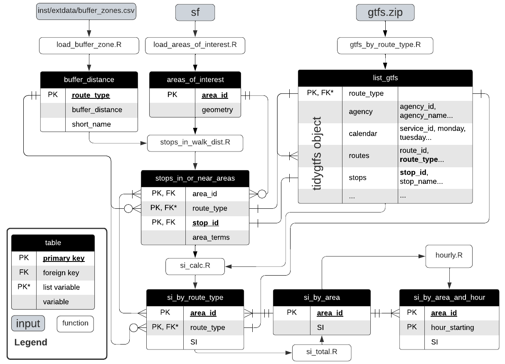

```{r, include = FALSE}
knitr::opts_chunk$set(
  collapse = TRUE,
  comment = "#>"
)
```

```{r setup}
library(dplyr)
library(gtfssupplyindex)
```

# Introduction

Use the gtfssupplyindex package to calculate Transit Supply Index (SI) scores 
from General Transit Feed Specification (GTFS) datasets.  The Transit Supply Index (SI) was developed in [Currie, G and Senbergs, Z (2007), Identifying spatial gaps in public transport provision for socially disadvantaged Australians – the Melbourne ‘needs-gap’ study](https://www.researchgate.net/profile/Graham-Currie/publication/37183562_Identifying_spatial_gaps_in_public_transport_provision_for_socially_disadvantaged_Australians_the_Melbourne_%27Needs-Gap%27_Study/links/0fcfd5097adf8d4656000000/Identifying-spatial-gaps-in-public-transport-provision-for-socially-disadvantaged-Australians-the-Melbourne-Needs-Gap-Study.pdf), presented at the Australasian Transport Research Forum.  


# Installation & Dependencies

This package requires the sf, gtfstools and tidytransit packages (amongst others). 

```{r install, eval = FALSE}
# Install devtools to allow package to be downloaded from github repository
install.packages("devtools") 
devtools::install_github("James-Reynolds/gtfssupplyindex")

```

# Background

## General Transit Feed Specification (GTFS)
The [tidytransit](https://cran.r-project.org/web/packages/tidytransit/vignettes/introduction.html) package has information and links relevant to the GTFS. 

## Transit Supply Index
The Transit Supply Index (SI) developed in [Currie, G and Senbergs, Z (2007)](https://www.researchgate.net/profile/Graham-Currie/publication/37183562_Identifying_spatial_gaps_in_public_transport_provision_for_socially_disadvantaged_Australians_the_Melbourne_%27Needs-Gap%27_Study/links/0fcfd5097adf8d4656000000/Identifying-spatial-gaps-in-public-transport-provision-for-socially-disadvantaged-Australians-the-Melbourne-Needs-Gap-Study.pdf) is shown below:

\begin{equation}
  SI_{area, time} = \sum{\frac{Area_{Bn}}{Area_{area}}*SL_{n, time}}
  \end{equation}


In which: 

- $SI_{area, time}$ is the Supply Index for the area of interest 
and a given period of time;
- $Area_{Bn}$ is the buffer area for each stop (n) within the area of interest. In Currie and Senbergs (2007) this was based on 
a radius of 400 metres for bus and tram stops, 
and 800 metres for railway stations;
- $Area_{area}$ is the area of the area of interest; and
- $SL_{n,time}$ is the number of transit arrivals for each stop 
for a given time period.

Minor adjustments have been made 
to generalise the equation, 
as the focus of Currie and Senbergs (2007) 
was on the context of Melbourne's Census Collection Districts (CCD) 
and calculations based on a week of transit service. 
CCDs predate the introduction of 
Statistical Areas 1, 2, 3, and 4 (SA1, SA2, SA3, SA4), 
and other geographical divisions 
currently used by the Australian Bureau of Statistics (ABS), 
which may be more familiar to some readers.

# gtfssupplyindex structure and function

The structure and functions used to generate each table are shown in the below Entity Relationship Diagram (ERD). 

```{r SI_ERD, fig.width = 10, fig.height = 2, fig.fullwidth = TRUE, fig.cap = "Entity Relationship Diagram (ERD) showing the data structure and functions", echo = FALSE, warning=FALSE, message=FALSE, cache=TRUE, out.width='100%'}


```

The package takes input from three files: 

- a gtfs feed (gtfs.zip)
- a sf object describing the geometry of the areas for which the SI is to be calculated
- a csv file defining the buffer zone distances (in metres) for each route_type - a version of this file is included in the package. 

Outputs can be generated in various formats, including the si_by_route_type table, si_by_area table and, if hourly values are desired, the si_by_area_and_hour table (bottom of ERD shown above)

The package includes a GTFS dataset from the [Mornington Penninsula Tourist Railway](https://transitfeeds.com/p/mornington-railway/806/latest) as sample data. Minor alternations have been made to the GTFS dataset to updated the route_colour field (as tidytransit throws an error if this is not present) and to change the route type to 2 ("rail"). The original feed uses a route_type of 107, which correlates with "tourist railway" in the extended GTFS route type definitions, which is not yet supported by all R packages related to GTFS analysis. 

GTFS data is first loaded, with the gtfs_by_route_type function splitting this into a list (by route_type) of tidygtfs objects. This is achieved using the filter_by_route_type() function from the [gtfstools package](https://cran.r-project.org/web/packages/gtfstools/index.html).

```{r load_mornington_GTFS data, echo = TRUE, warning=FALSE, message=FALSE, cache=TRUE, out.width='100%'}
#load the revised mornington GTFS data
list_gtfs = gtfssupplyindex:::gtfs_by_route_type(system.file(
  "extdata/mornington180109",
  "gtfs.zip", 
  package = "gtfssupplyindex", 
  mustWork = TRUE))

```

Geographical data about the areas of interest are loaded by the load_areas_of_interest() function into an [sf object](https://r-spatial.github.io/sf/). The resultant areas_of_interest table contains each area_id and its associated geometry.   

```{r load_ABS data, echo = FALSE, warning=FALSE, message=FALSE, cache=TRUE, out.width='100%'}
areas_of_interest <- load_areas_of_interest(areas_of_interest = sf::st_read(system.file(
  "extdata",
  "mornington_sa12021.geojson", 
  package = "gtfssupplyindex", 
  mustWork = TRUE)), 
  area_id_field = "sa1_code_2021")
head(areas_of_interest) %>% knitr::kable(caption = "First 6 entries in areas_of_interest table")

```

Data about buffer zones, specifically the walking distance threshold assigned to each route_type (mode) is then loaded with the load_buffer_zone() function. The package includes this information in a csv file, in which it is assumed that the buffer zone is defined in metres. 

```{r load_buffer_distance_data, echo = FALSE, warning=FALSE, message=FALSE, cache=TRUE, out.width='100%'}
buffer_distance <- gtfssupplyindex:::load_buffer_zones()
head(buffer_distance) %>% knitr::kable(caption = "First six entries in buffer_distance definitions")
```

The stops_in_walk_dist() function then generates a list (by route_type) in which each element is a datatable describing which stops are within walking distance of which areas of interest. Each table entry includes a stop_id, an area_id that is within the buffer_distance threshold of that stop, and the corresponding area related terms in the SI calculation^[This is the $Area_{Bn} / Area_{Area}$ bit]. 

```{r calculate_stop_in_or_near_areas, echo = FALSE, warning=FALSE, message=FALSE, cache=TRUE, out.width='100%'}
stops_in_or_near_areas <- gtfssupplyindex:::stops_in_walk_dist(
  list_gtfs = list_gtfs, 
  areas_of_interest = areas_of_interest,
  EPSG_for_transform = 28355, 
  verbose = TRUE
)

head(stops_in_or_near_areas[[1]]) %>% knitr::kable(caption = "'Rail' element of the stops_in_or_near_areas list for the Mornington Pennisula datasets, first six entries")
```
